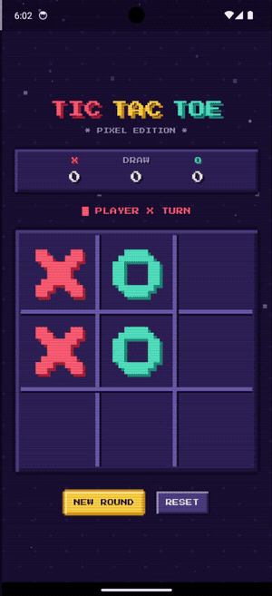
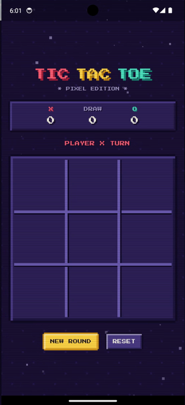
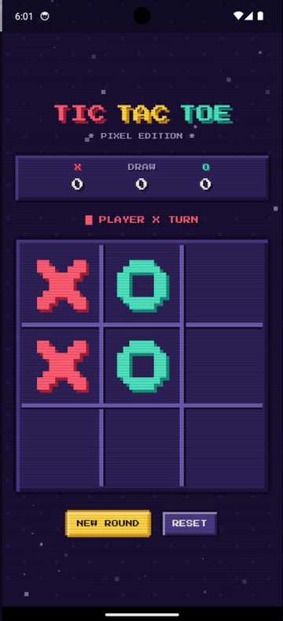
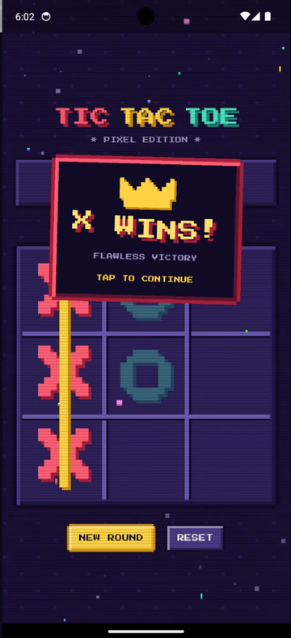
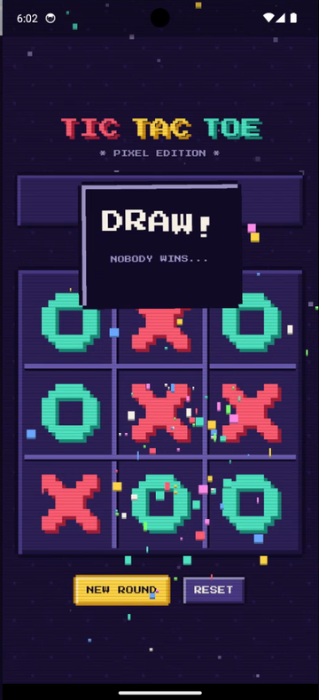
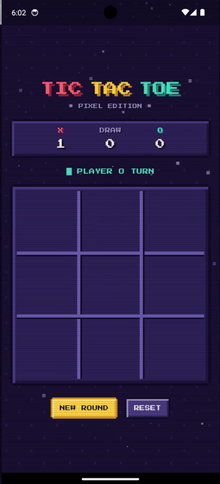
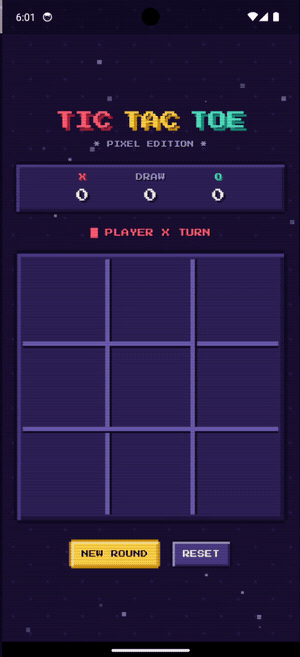
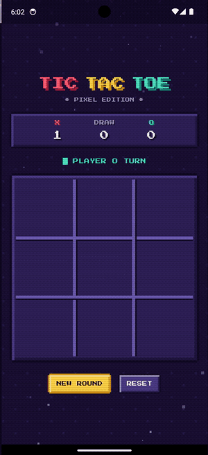

<div align="center">

# 🕹️ Pixel Tic-Tac-Toe

**Tres en raya en Flutter con estética pixel art, sonido chiptune y una celebración de victoria exagerada.**

[](https://flutter.dev)
[](https://dart.dev)
[](#-instalación)
[](https://github.com/BOTOOM/pixel_tictactoe/releases/latest)



</div>

---

## ✨ Características

| | |
|---|---|
| 🎨 **100 % pixel art** | Sprites 8×8 de X, O y corona dibujados con `CustomPainter` (sin antialiasing), paneles con bisel 8-bit, fondo con dithering y estrellas, scanlines CRT y fuente *Press Start 2P*. |
| 🏆 **Victoria épica** | Sacudida de pantalla, línea dorada que barre las casillas ganadoras con chispas, flash, confeti pixel con gravedad, banner que rebota con corona y texto arcoíris letra a letra. |
| 🔊 **Audio chiptune** | Blip descendente para X, ascendente para O, fanfarria al ganar, motivo de empate y música 8-bit de fondo en loop a bajo volumen. Botón `SFX ON/OFF`. Todos los sonidos se generan proceduralmente con [`tool/gen_sounds.py`](tool/gen_sounds.py). |
| 🧮 **Marcador** | Cuenta victorias de X, de O y empates; el jugador que abre cada ronda se alterna. |
| 🪶 **Ligera** | Una única dependencia de terceros (`audioplayers`). Sin permiso de Internet, sin anuncios, sin telemetría. |

## 📸 Capturas

<p align="center">
  
  
  
  
  
</p>

## 🎬 Así se juega

<table align="center">
  <tr>
    <th>Turnos X / O</th>
    <th>¡Victoria!</th>
    <th>Empate</th>
  </tr>
  <tr>
    <td></td>
    <td></td>
    <td></td>
  </tr>
</table>

<p align="center">🎥 <a href="docs/media/demo.mp4">Ver la demo completa en video</a> (lanzamiento → victoria → nueva ronda → empate → reset)</p>

## 📦 Instalación

### Android (APK, sin tienda)

1. Descarga el APK desde la [última release](https://github.com/BOTOOM/pixel_tictactoe/releases/latest):
   - `pixel_tictactoe-vX.Y.Z-arm64-v8a.apk` → la mayoría de móviles actuales (recomendado).
   - `pixel_tictactoe-vX.Y.Z-armeabi-v7a.apk` → móviles antiguos de 32 bits.
   - `pixel_tictactoe-vX.Y.Z-x86_64.apk` → emuladores / Chromebooks.
   - `pixel_tictactoe-vX.Y.Z-universal.apk` → funciona en todo (más pesado).
2. Ábrelo en el teléfono y permite *Instalar apps desconocidas* para tu navegador o gestor de archivos.
3. Opcional: verifica la integridad con `sha256sum` contra `SHA256SUMS.txt` de la release.

Los APK van firmados con una clave de release propia, minificados (R8) y con recursos recortados.

### iOS

No se publica un `.ipa`: iOS no permite instalar apps fuera de la App Store sin una cuenta de desarrollador Apple y una firma por dispositivo. Si tienes un Mac con Xcode y una cuenta de desarrollador:

```sh
flutter build ipa --release        # o: flutter run -d <tu-iphone>
```

y despliega el `.ipa` resultante con Xcode / Apple Configurator / TestFlight.

### Web

```sh
flutter build web --release        # salida en build/web
```

## 🛠️ Desarrollo

```sh
flutter pub get
flutter run -d chrome              # web
flutter run -d emulator-5554       # emulador Android
flutter analyze && flutter test    # lint + tests
```

Regenerar los sonidos (solo la biblioteca estándar de Python):

```sh
python3 tool/gen_sounds.py
```

### Estructura

```
lib/
├── main.dart           # pantalla de juego, sacudida, línea ganadora, controles
├── game_logic.dart     # GameState inmutable: jugadas, ganador, marcador, rondas
├── pixel_widgets.dart  # paleta, texto/paneles/botones pixel, sprites, fondo, scanlines
├── win_animation.dart  # overlay de victoria/empate: flash, confeti, banner con corona
└── audio.dart          # SFX + música de fondo (audioplayers)
assets/
├── fonts/              # Press Start 2P
└── sounds/             # WAV generados por tool/gen_sounds.py
```

## 📄 Licencia

MIT — haz con ella lo que quieras, incluso ganarle a tu hermano pequeño.
